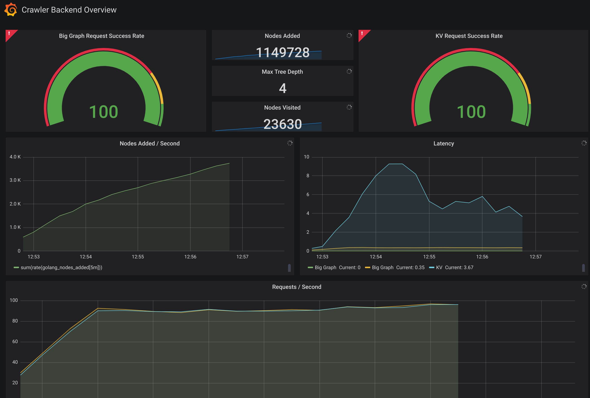

# crawler-deployment

Docker and Kubernetes deployment configuration for distributed web crawlers indexing to [big-data graph DB](https://github.com/dgoldstein1/graphApi).

[](https://circleci.com/gh/dgoldstein1/crawler)



## Run Locally

Indexes around 100k nodes and exit.

### Kubernetes

```sh
# start local minikube
minikube start
...
# start local cluster
kubectrl create -f k8
service/graph created
deployment.apps/graph created
service/crawler created
deployment.apps/crawler created
service/kv created
deployment.apps/kv created
service/prom created
deployment.apps/prom created
...
# see that all pods are working
kubectrl get pods --watch
...
# once all pods are up, look at the dashboard
# The username / password are "admin" / "admin".
minikube service grafana
# see that nodes have been added to the graph service
kubectl describe service graph | grep TCP
Port:                     main  5000/TCP
TargetPort:               5000/TCP
NodePort:                 main  30084/TCP
Port:                     metrics  8001/TCP
TargetPort:               8001/TCP
NodePort:                 metrics  31199/TCP
curl $(minikube ip):30084/info
Python type PNGraph: Directed
  Nodes:                    304
  Edges:                    303
  Zero Deg Nodes:           0
  Zero InDeg Nodes:         1
  Zero OutDeg Nodes:        303
  NonZero In-Out Deg Nodes: 0
```

### Docker

```sh
docker-compose up -d
```
Go to http://localhost:3000 to access grafana and find the dashboard "Crawler Backend Overview".

## Deployment

### Kubernetes on GKE

Create a gcloud account, and create a standard k8 cluster.
```sh
gcloud init
# see current projects available
gcloud config list
[compute]
region = us-central1
zone = us-central1-a
[core]
account = dgoldstein01@gmail.com
disable_usage_reporting = True
project = crawler-deployment

Your active configuration is: [default]
# set kubectl to use standar-cluster-1
gcloud container clusters get-credentials standard-cluster-1
# create pods one at a time or else it's easy to overwhelm the cluster
kubectl create -f k8/graph.yaml
kubectl get pods --watch
...
# once all have been deployed, proxy to local machine:
kubectl proxy
# hit the graph service in a new tab
curl http://localhost:8001/api/v1/namespaces/default/services/graph/proxy/info
Python type PNGraph: Directed
  Nodes:                    12159
  Edges:                    15897
  Zero Deg Nodes:           0
  Zero InDeg Nodes:         0
  Zero OutDeg Nodes:        12114
  NonZero In-Out Deg Nodes: 45
# open up grafana
gnome-open http://localhost:8001/api/v1/namespaces/default/services/grafana/proxy/d/-ItR25vWz/crawler-backend-overview?orgId=1&refresh=5s
```

## Authors

* **David Goldstein** - [DavidCharlesGoldstein.com](http://www.davidcharlesgoldstein.com/?crawler-deployment) - [Decipher Technology Studios](http://deciphernow.com/)

## License

This project is licensed under the MIT License - see the [LICENSE.md](LICENSE.md) file for details
